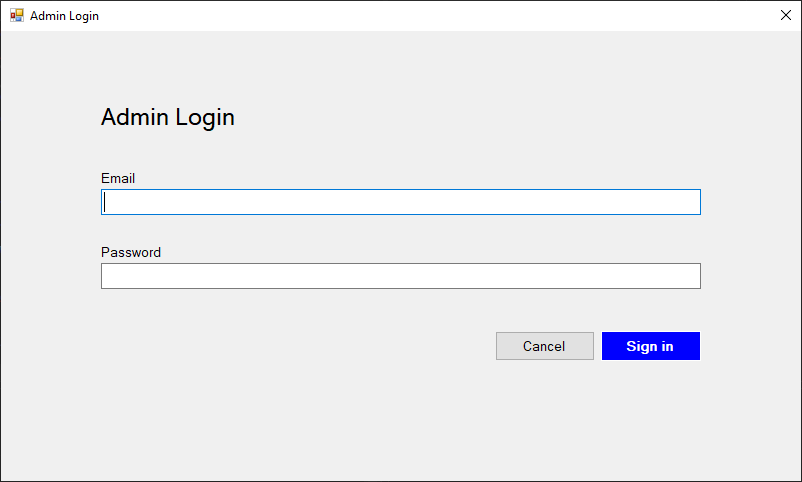
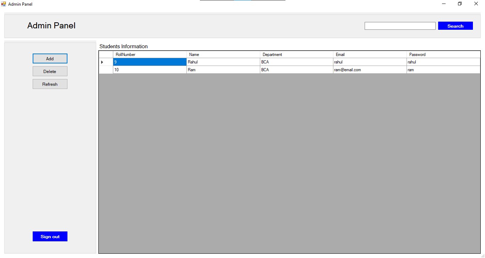
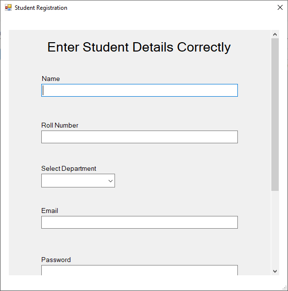
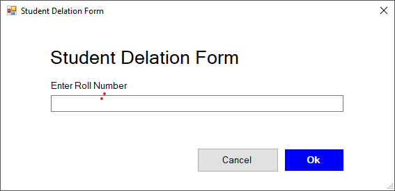

# StudentsManagementSystem
## About
Hello, I am ankit. Student management system is my first Project After learning Dotnet and c#. It's a simple software for managing student. I use c# Programming for framework i used Dotnet Framework, ADO.net, MySQl Client and as for Backend I use mysql and XAMPP Server. Here is snapshot of StudentManagementSystem.  

